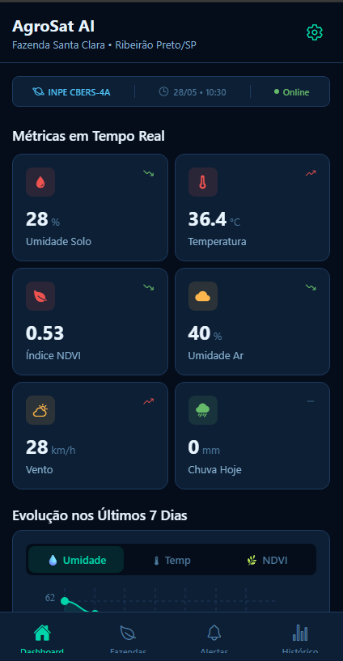
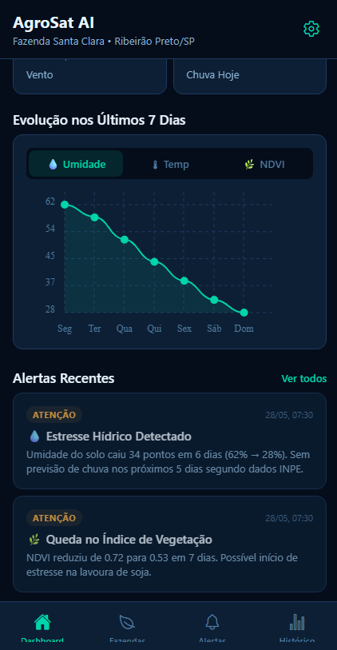
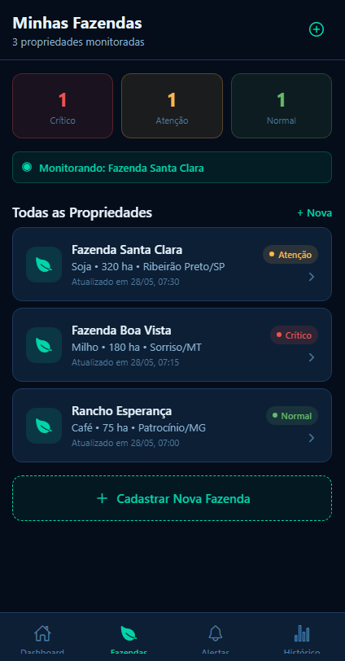
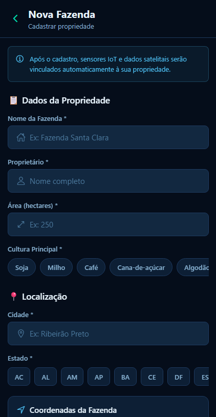
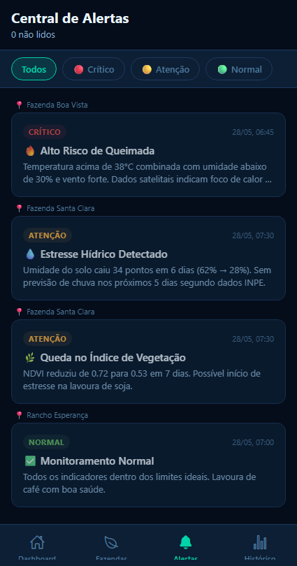
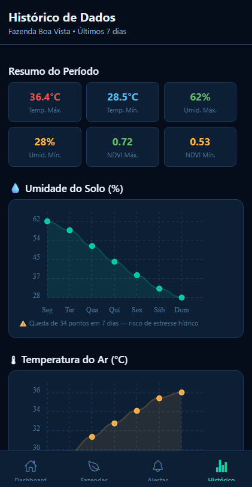
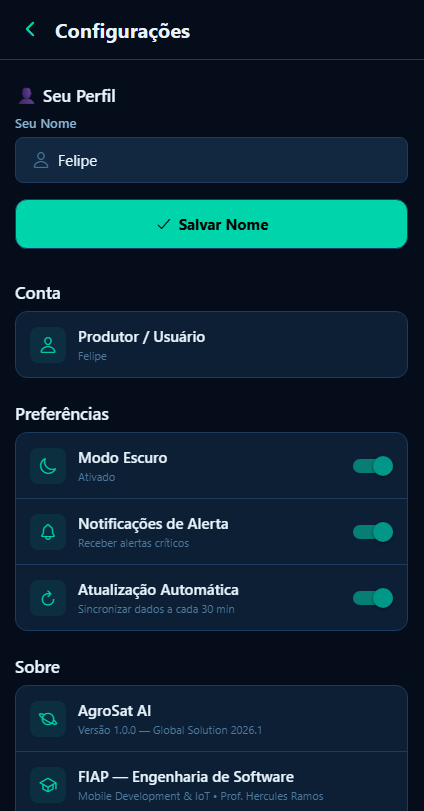

<div align="center">

<br />

```
   █████╗  ██████╗ ██████╗  ██████╗ ███████╗ █████╗ ████████╗     █████╗ ██╗
  ██╔══██╗██╔════╝ ██╔══██╗██╔═══██╗██╔════╝██╔══██╗╚══██╔══╝    ██╔══██╗██║
  ███████║██║  ███╗██████╔╝██║   ██║███████╗███████║   ██║       ███████║██║
  ██╔══██║██║   ██║██╔══██╗██║   ██║╚════██║██╔══██║   ██║       ██╔══██║██║
  ██║  ██║╚██████╔╝██║  ██║╚██████╔╝███████║██║  ██║   ██║       ██║  ██║██║
  ╚═╝  ╚═╝ ╚═════╝ ╚═╝  ╚═╝ ╚═════╝ ╚══════╝╚═╝  ╚═╝   ╚═╝       ╚═╝  ╚═╝╚═╝
```

### Agricultura Inteligente por Satélite

[](https://reactnative.dev/)
[](https://expo.dev/)
[](https://www.typescriptlang.org/)

**Global Solution 2026.1 — FIAP Engenharia de Software**  
Mobile Development & IoT · Prof. Hercules Ramos

</div>

---

## 🌾 Sobre o Projeto

O **AgroSat AI** é uma plataforma mobile de monitoramento agrícola que une **dados de satélites**, **sensores IoT instalados no campo** e **inteligência artificial** para ajudar produtores rurais brasileiros a tomarem decisões mais rápidas e precisas.

O app coleta e cruza informações de múltiplas fontes para detectar riscos como seca, queimadas, pragas e queda no índice de vegetação — gerando alertas automáticos com recomendações práticas antes que o problema se torne irreversível.

---

## 🛰️ Conexão com a Indústria Espacial

A solução vai além dos sensores terrestres. O **NDVI** (Normalized Difference Vegetation Index) é calculado a partir de imagens multiespectrais do satélite **INPE CBERS-4A**, enquanto os focos de calor são monitorados via **NASA FIRMS** — dados que só existem graças à tecnologia espacial e que transformam o monitoramento de uma fazenda de reativo para preditivo.

```
  🛰️ INPE CBERS-4A ─────► NDVI (saúde da vegetação)
  🛰️ NASA FIRMS ──────────► Focos de calor / risco de queimada
  🌡️ Sensores IoT ─────────► Temperatura, umidade do solo e do ar
  🌦️ INMET ────────────────► Dados meteorológicos locais
                    │
                    ▼
            [ Análise por IA ]
                    │
                    ▼
         📱 Alerta no celular do produtor
```

---

## 📱 Telas do App

<br />

<div align="center">

### Dashboard

<table>
  <tr>
    <td align="center">
      
      <br /><sub><b>Métricas em Tempo Real</b></sub>
      <br /><sub>Temperatura, umidade, NDVI, vento</sub>
    </td>
    <td align="center">
      
      <br /><sub><b>Gráfico de Evolução + Alertas</b></sub>
      <br /><sub>Histórico de 7 dias e alertas recentes</sub>
    </td>
  </tr>
</table>

---

### Fazendas & Cadastro

<table>
  <tr>
    <td align="center">
      
      <br /><sub><b>Minhas Fazendas</b></sub>
      <br /><sub>Status de cada propriedade</sub>
    </td>
    <td align="center">
      
      <br /><sub><b>Cadastrar Fazenda</b></sub>
      <br /><sub>Formulário com validação completa</sub>
    </td>
  </tr>
</table>

---

### Alertas & Histórico

<table>
  <tr>
    <td align="center">
      
      <br /><sub><b>Central de Alertas</b></sub>
      <br /><sub>Filtro por nível: crítico, atenção, normal</sub>
    </td>
    <td align="center">
      
      <br /><sub><b>Histórico de Dados</b></sub>
      <br /><sub>Gráficos de umidade, temperatura e NDVI</sub>
    </td>
  </tr>
</table>

---

### Configurações

<table>
  <tr>
    <td align="center">
      
      <br /><sub><b>Configurações</b></sub>
      <br /><sub>Perfil, tema escuro/claro e preferências</sub>
    </td>
  </tr>
</table>

</div>

---

## ⚙️ Instalação e Execução

### Pré-requisitos

- [Node.js](https://nodejs.org/) 18 ou superior
- [Git](https://git-scm.com/)
- App **Expo Go** instalado no celular ([Android](https://play.google.com/store/apps/details?id=host.exp.exponent) · [iOS](https://apps.apple.com/app/expo-go/id982107779))

> **Windows:** Caso apareça o erro `"a execução de scripts foi desabilitada neste sistema"`, abra o PowerShell como Administrador e execute uma única vez:
> ```powershell
> Set-ExecutionPolicy -Scope CurrentUser -ExecutionPolicy RemoteSigned
> ```

### Passo a passo

**1. Clonar o repositório**
```bash
git clone https://github.com/SEU_USUARIO/agrosat-ai.git
cd agrosat-ai
```

**2. Instalar as dependências**

> Sempre use `npx expo install` para pacotes do ecossistema Expo — ele escolhe automaticamente a versão compatível com o SDK.

```bash
npm install
```

**3. Iniciar o projeto**
```bash
npx expo start
```

**4. Abrir no celular**

Com o app **Expo Go** aberto, escaneie o QR Code exibido no terminal.

**Emulador Android / iOS**
```bash
# Android
npx expo start --android

# iOS (apenas macOS)
npx expo start --ios
```

---

## 🗂️ Estrutura do Projeto

```
agrosat-ai/
├── app/
│   ├── (tabs)/
│   │   ├── _layout.tsx        # Navegação por abas
│   │   ├── index.tsx          # Dashboard principal
│   │   ├── farms.tsx          # Lista de fazendas
│   │   ├── alerts.tsx         # Central de alertas
│   │   └── history.tsx        # Histórico com gráficos
│   ├── farm/[id].tsx          # Detalhe da fazenda
│   ├── alert/[id].tsx         # Detalhe do alerta
│   ├── add-farm.tsx           # Formulário de cadastro
│   ├── settings.tsx           # Configurações
│   └── _layout.tsx            # Layout raiz com Provider
├── components/
│   └── ui.tsx                 # Componentes reutilizáveis
├── context/
│   ├── AppContext.tsx          # Context API + AsyncStorage
│   └── theme.ts               # Design tokens (dark/light)
├── data/
│   └── mockData.ts            # Dados simulados tipados
└── README.md
```

---

## 🛠️ Tecnologias

| Tecnologia | Uso |
|---|---|
| React Native + Expo SDK 52 | Base do app mobile |
| Expo Router | Navegação por sistema de arquivos |
| TypeScript | Tipagem estática em 100% do projeto |
| Context API | Estado global (tema, fazendas, alertas) |
| AsyncStorage | Persistência local de dados |
| react-native-chart-kit | Gráficos LineChart e BarChart |
| @expo/vector-icons | Ícones Ionicons |

---

## 🌍 Alinhamento com ODS da ONU

- 🌾 **ODS 2** — Fome Zero e Agricultura Sustentável
- 🌡️ **ODS 13** — Ação Contra a Mudança Global do Clima
- 🌿 **ODS 15** — Vida Terrestre

---

## 👥 Integrantes

| Nome | RM |
|------|----|
| Felipe Braunstein e Silva | RM554483 |
| Felipe do Nascimento Fernandes | RM554598 |
| Henrique Ignacio Bartalo | RM555274 |
| Gustavo Henrique Martins | RM556956 |

---

<div align="center">

**FIAP — Engenharia de Software · 3º Ano · Global Solution 2026.1**

</div>
